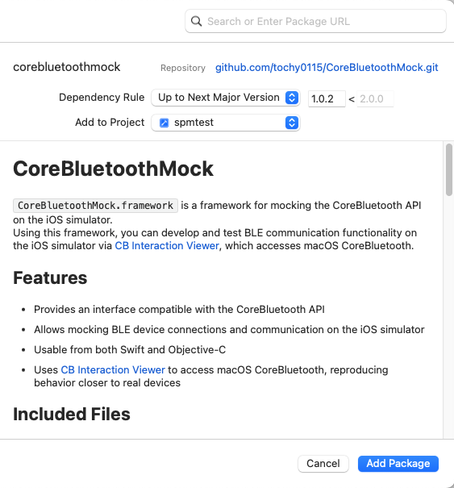
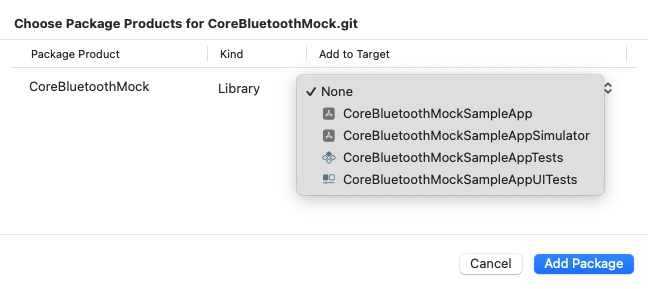
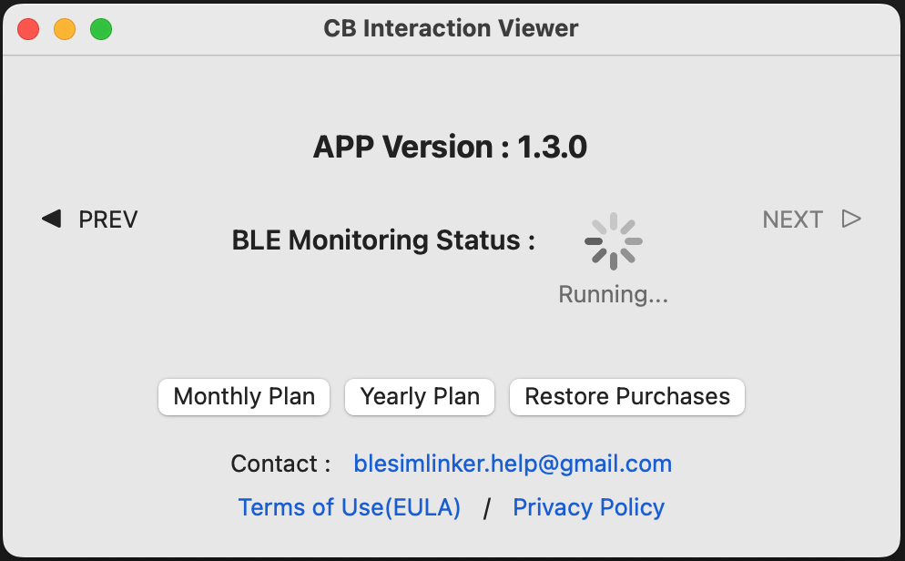

# CoreBluetoothMock

`CoreBluetoothMock.framework` は、iOS シミュレータ上で CoreBluetooth API をモックするためのフレームワークです。  
このフレームワークを使うことで、macOS の CoreBluetooth にアクセスする [CB Interaction Viewer](https://apps.apple.com/jp/app/cb-interaction-viewer/id6757977616?mt=12) を介して、iOS シミュレータ上で BLE 通信機能を開発・テストできます。

## 特徴

- CoreBluetooth API と互換性のあるインターフェースを提供
- iOS シミュレータ上で BLE デバイスの接続・通信をモック可能
- Swift / Objective-C の両方から利用可能
- [CB Interaction Viewer](https://apps.apple.com/jp/app/cb-interaction-viewer/id6757977616?mt=12) を介して macOS の CoreBluetooth を利用し、より実機に近い挙動を再現

## 同梱ファイル

### SPM パッケージ構成

- `Package.swift`: 製品 `CoreBluetoothMock` を公開する Swift Package マニフェスト
- `Sources/CoreBluetoothMockWrapper/`: パッケージ製品で使用するラッパーターゲットのソース
- `CoreBluetoothMock.xcframework.zip`（GitHub Releases）: Swift Package Manager が取得するバイナリアーティファクト

### サンプルアプリ

- `CoreBluetoothMockSampleApp/`: Swift サンプルアプリ（シミュレータ/実機の条件付き import を実装）
- `CoreBluetoothMockSampleAppObjC/`: Objective-C サンプルアプリ（シミュレータ/実機の条件付き import を実装）
- `CoreBluetoothMockSampleApps.xcworkspace/`: 2 つのサンプルアプリを含むワークスペース
- `LICENCE_SAMPLE_APPS.txt`: サンプルアプリ向けライセンス（Apache License 2.0）

## 対応環境

- Xcode 16.0 以降
- Swift / Objective-C
- シミュレータ iOS 16.0 以降
- [CB Interaction Viewer](https://apps.apple.com/jp/app/cb-interaction-viewer/id6757977616?mt=12) 1.1.2 以降

## 導入方法

1. Xcode プロジェクトを開き、Swift Package Manager で以下の URL を追加します。
	- `https://github.com/tochy0115/CoreBluetoothMock.git`
2. バージョンルール（例: **Up to Next Major**）を選択し、`1.0.2` 以降を指定します。

  

3. アプリターゲットに、パッケージ製品 `CoreBluetoothMock` を追加します。



4. CoreBluetooth の import を、シミュレータ/実機の条件付き import に置き換えます。

### Swift
```swift
#if targetEnvironment(simulator)
import CoreBluetoothMock
#else
import CoreBluetooth
#endif
```

### Objective-C
```objc
#if TARGET_OS_SIMULATOR
#import <CoreBluetoothMock/CoreBluetoothMock.h>
#else
#import <CoreBluetooth/CoreBluetooth.h>
#endif
```

5. iOS シミュレータでアプリを実行する前に、macOS で [CB Interaction Viewer](https://apps.apple.com/jp/app/cb-interaction-viewer/id6757977616?mt=12) を起動します。



## 注意点

- 実機での Bluetooth 通信テストには CoreBluetooth.framework を使用してください。
- 本フレームワークはシミュレータ用モックであり、すべての実機挙動を再現するものではありません。
- [CB Interaction Viewer](https://apps.apple.com/jp/app/cb-interaction-viewer/id6757977616?mt=12) を起動していない場合、シミュレータ上で CoreBluetoothMock は正常に動作しません。
- **本フレームワークの改ざん、リバースエンジニアリング、逆コンパイル、解析行為は禁止です。**

## ライセンス

- `CoreBluetoothMock.framework`: 独自ライセンス（`LICENCE.txt` を参照）
- サンプルアプリ（`CoreBluetoothMockSampleApp/`, `CoreBluetoothMockSampleAppObjC/`）: Apache License 2.0（`LICENCE_SAMPLE_APPS.txt` を参照）

